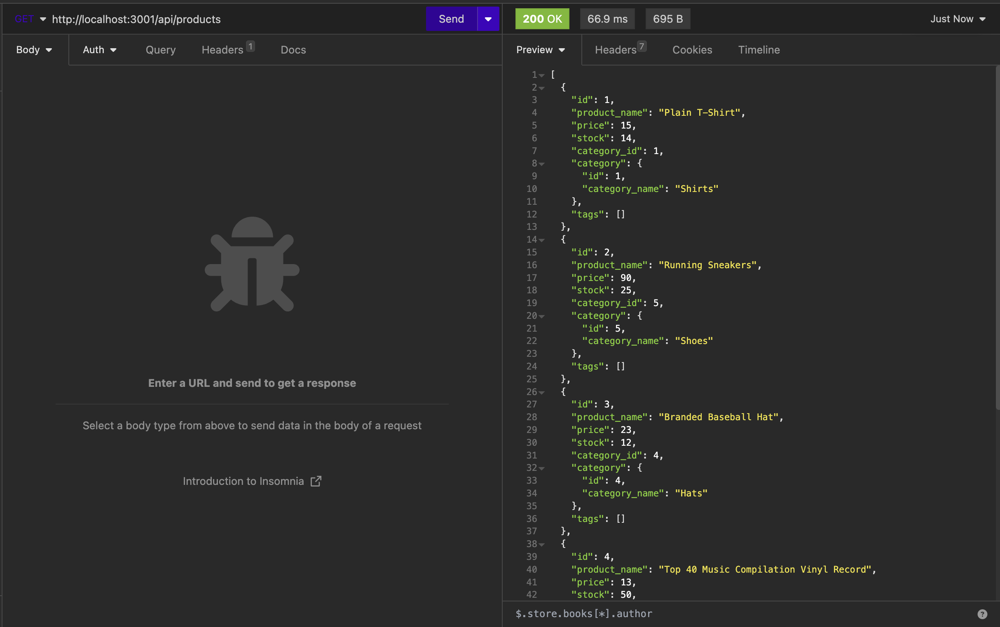

# eCommerce-Back-End

## Table of Contents 

- [Description](#description)
- [Installation](#installation)
- [Usage](#usage)
- [Badges](#badges)
- [How to Contribute](#how-to-contribute)

## Description

Welcome to the world of internet retail, where e-commerce drives the electronics industry forward. This powerful phenomenon enables seamless online transactions for businesses and consumers, transforming the way we buy and sell electronic products. In 2021, the United States alone witnessed a staggering $2.54 trillion in e-commerce revenue, according to the United Nations Conference on Trade and Development. Leading platforms like Shopify and WooCommerce offer a range of services catering to businesses of all sizes. For developers, grasping the fundamental architecture of these platforms is crucial. In this challenge, I dove into the backend realm of e-commerce, configuring a working Express.js API to interact with a MySQL database using Sequelize. 

## Installation

1. Clone the repository to you local IDE.

2. Install the [Insomnia](https://insomnia.rest/download) program.

3. Create a .env file and enter the following text:

```
DB_NAME='ecommerce_db'
DB_PW='{ your mysql password }'
DB_USER='root'
```

4. Create a .gitignore file and add the following text to hide your personal information:

```
.env
node_modules
```

5. Run ```npm install``` in your local IDE to install the required dependencies.

6. Run ```mysql -u root -p ``` and enter your mysql password to start mysql.

7. Run ```source db/schema.sql;``` to set up the schema for your database.

8. Run ```npm run seed``` to seed the data in your seeds folders.

9. Run ```node server.js``` to start the server.

## Usage

Open the Insomnia program and navigate to the GET routes for categories, products, and tags by entering the following URLs:

http://localhost:3001/api/categories

http://localhost:3001/api/products

http://localhost:3001/api/tags

Below is an example of the /products GET route.



Check out a walkthrough video here: https://drive.google.com/file/d/1FxyX6BAz5DJR-f7t4x1jXN_ZWEXA9rhB/view?usp=sharing

## Badges

    

## How to Contribute

Please contact me via my [Github](https://github.com/Kiararj) if you would like to contribute. 